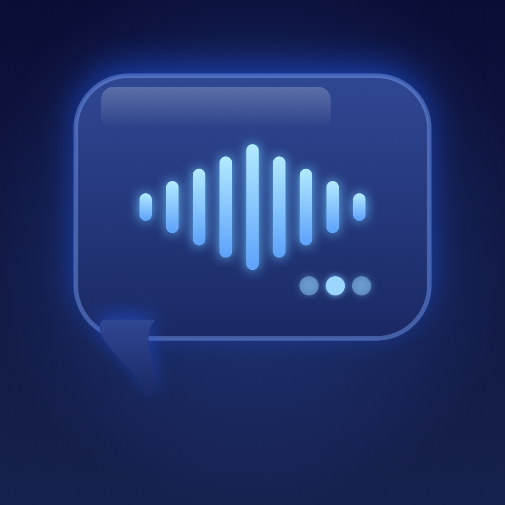

# Blabber

An iOS app for recording car conversations. Blabber listens continuously but only captures speech — silence is automatically skipped. Each session is named after the location where it was recorded.

## Features

- **Voice activity detection** — records only when speech is detected; silence is discarded
- **Location-named sessions** — each recording is automatically labeled with the reverse-geocoded location
- **Waveform visualization** — real-time audio waveform display while recording
- **Video capture** — optional front-camera recording overlaid on the app icon while a session is active
- **Playback with scrubbing** — review recordings with a full playback interface
- **Portrait and landscape support** — adaptive layout for both orientations

## Tech Stack

- SwiftUI
- AVFoundation (AVAudioEngine + VAD tap, AVCaptureSession)
- SoundAnalysis (speech classification)
- CoreLocation + CLGeocoder
- XcodeGen (project generation from `project.yml`)
- No external dependencies

## Building

1. Install [XcodeGen](https://github.com/yonaskolb/XcodeGen) if needed: `brew install xcodegen`
2. Generate the Xcode project: `xcodegen generate`
3. Open `Blabber.xcodeproj` in Xcode and build (⌘R)
